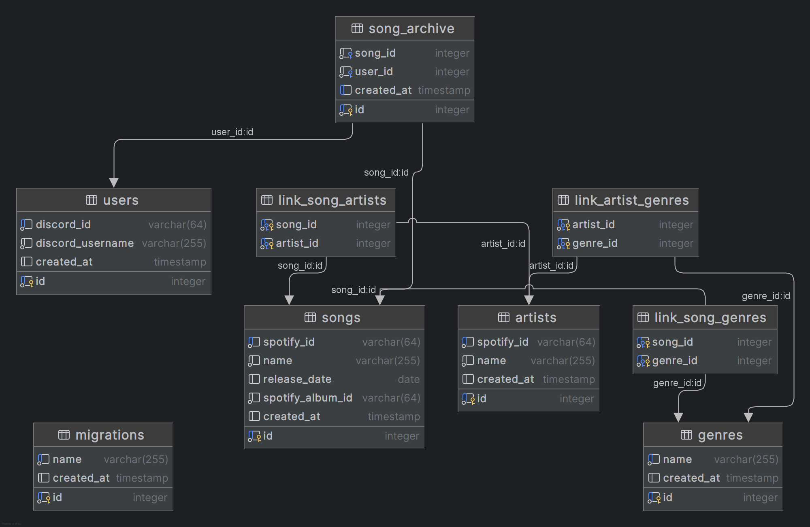

# vaultbot-lite-v2

## Requirements

- Go 1.24
- Docker (recommended for running Postgres)

## Configuration

Set the following environment variables:

- `POSTGRES_HOST`
- `POSTGRES_PORT`
- `POSTGRES_USER`
- `POSTGRES_PASSWORD`
- `DISCORD_GUILD_ID` (optional, recommended during development for immediate setting of Discord slash commands)
- `DISCORD_ADMINISTRATOR_USER_ID` (required, this is the user ID of the bot owner)
- `DISCORD_TOKEN` (more information below)
- `SPOTIFY_PLAYLIST_ID` (ID of the playlist that songs will be stored in)
- `SPOTIFY_CLIENT_ID`
- `SPOTIFY_CLIENT_SECRET`
- `SPOTIFY_TOKEN` (very important, see below)

If running locally, you can set these in a `.env` file in the root directory, then make sure that you set an additional environment variable `ENVIRONMENT=local`. (it can technically be any non-empty string)

### Discord

Create a new Discord application and bot. You will need the bot token to authenticate with the Discord API. You may need to enable some additional opt-in intents in the Discord Developer Dashboard.

### Spotify

Create a Spotify Developer account and create a new application. You will need the client ID and client secret to authenticate with the Spotify API.

Make sure to register the redirect URI as `http://localhost:8080/callback` in the Spotify Developer Dashboard.

Run the application ONCE locally. A Spotify authentication page should appear in your browser. After logging in, you will be redirected to `http://localhost:8888/callback`. The app will have created a new file in the root `token.txt`. Copy the contents of this file and set it as the `SPOTIFY_TOKEN` environment variable.

This is critical because some scopes necessary for this app are not available via Client Credentials Flow, so this is a one-time Authorization Code Flow to get the necessary refresh token so that the app can programmatically retrieve new access tokens with the necessary scopes.

The token generation by the app may be subject to change in the future.

#### Notes

The audio features endpoint is deprecated. This means that measurements of individual song features, like valence or energy, are unavailable
1. https://community.spotify.com/t5/Spotify-for-Developers/Changes-to-Web-API/td-p/6540414
2. https://developer.spotify.com/blog/2024-11-27-changes-to-the-web-api

## Misc

Very simple schema
