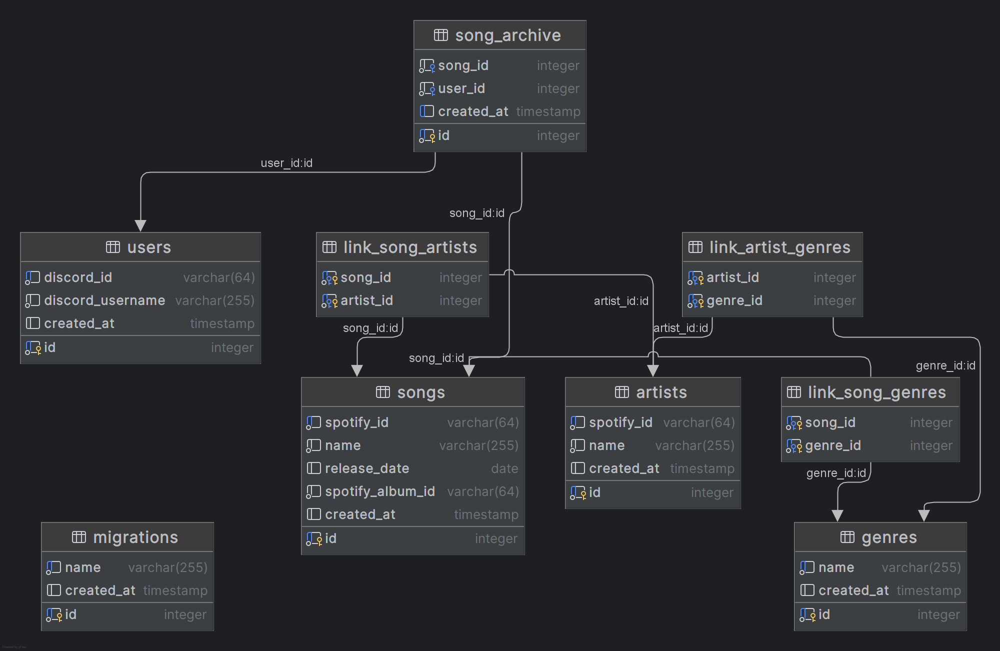

# vaultbot-lite-v2

Tracks music listening by monitoring a Spotify playlist. Tracks added to the playlist are recorded in a Neon PostgreSQL database. Scheduled jobs handle polling, cleanup, and curated playlist generation — all run as stateless GitHub Actions workflows with no long-running service.

## Requirements

- Go 1.26
- A [Neon](https://neon.tech) PostgreSQL database
- A Spotify Developer application

## Configuration

All required environment variables are documented in [`.env.example`](.env.example). Copy it to `.env` for local development — `godotenv` loads it automatically.

In GitHub Actions, variables are stored as repository secrets. See [`.devcontainer/SETUP.md`](.devcontainer/SETUP.md) for the complete list of secret names as they must be configured.

### Spotify token

`SPOTIFY_TOKEN` is a serialized OAuth2 token in the format `accessToken|refreshToken|tokenType|expiryUnix`. Use the auth tool in `scripts/spotify-auth-code-flow/` to obtain it — see [`.devcontainer/SETUP.md`](.devcontainer/SETUP.md) §1c for the full steps. Once stored, the embedded refresh token means the access token is renewed automatically on every run.

## GitHub Codespaces

This repo includes a devcontainer for use with GitHub Codespaces. When a codespace starts, it automatically creates a Neon database branch scoped to the current git branch and writes the connection details into `.env` — no local Postgres container needed.

See [`.devcontainer/SETUP.md`](.devcontainer/SETUP.md) for first-time setup instructions.

When finished with a branch, delete its Neon branch by running:

```sh
bash .devcontainer/scripts/neon-branch-teardown.sh
```

## Database schema


